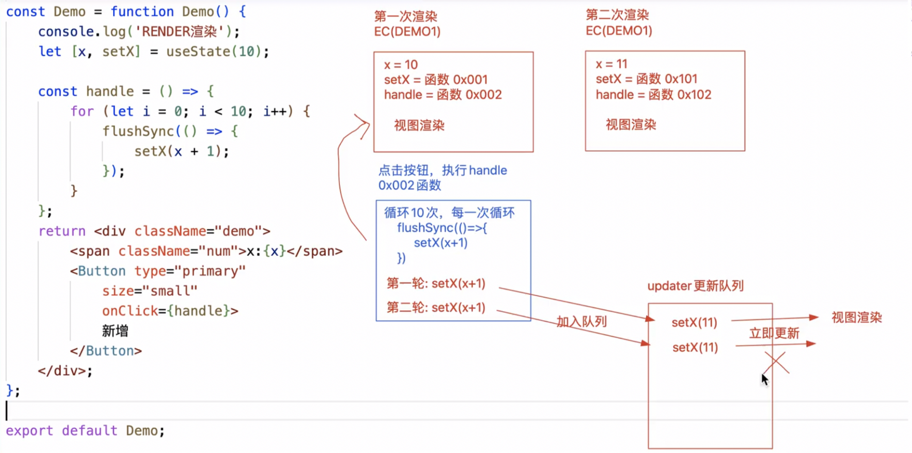
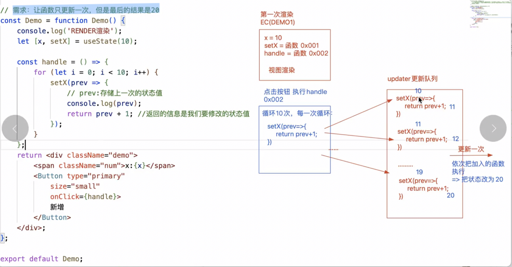
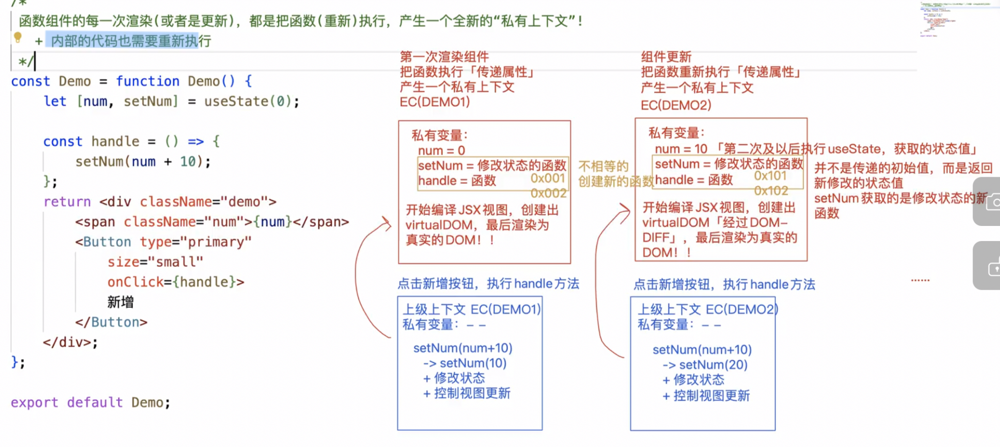
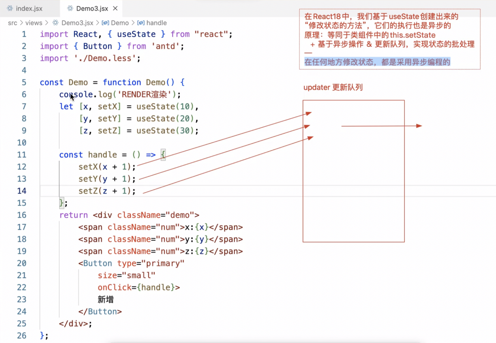
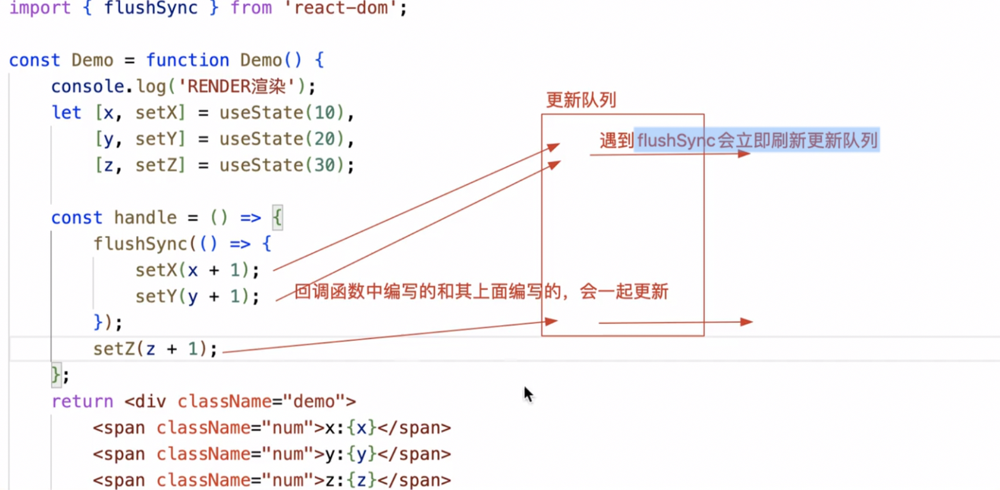
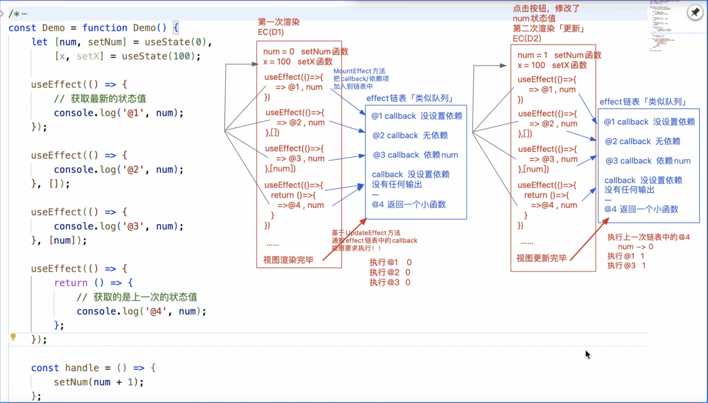
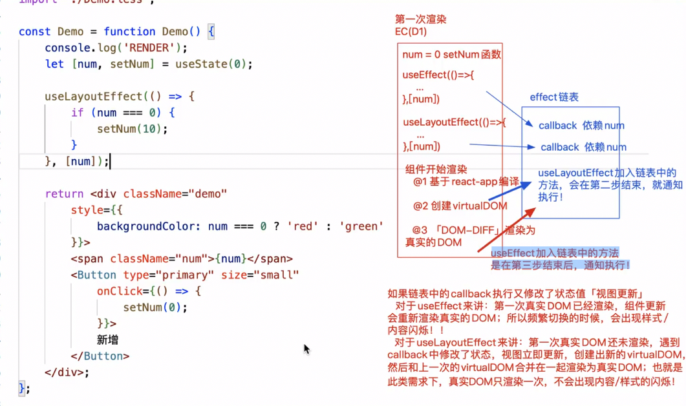
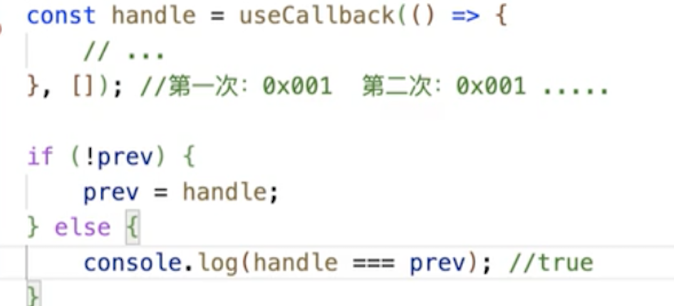
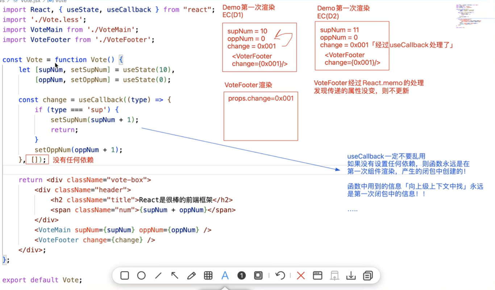
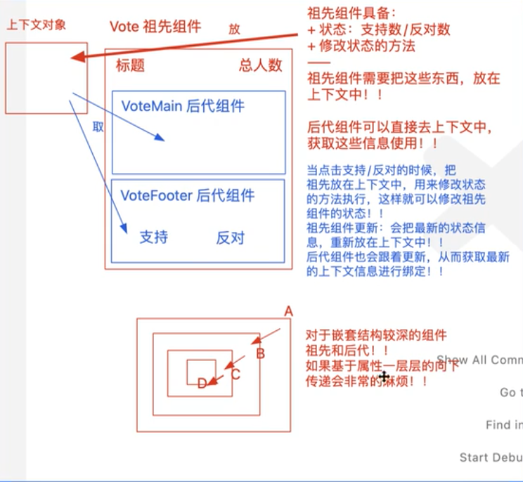

<!--
 * @Desc: md
 * @Author: zcc
 * @LastEditors: zcc
 * @Date: 2023-02-14 10:06:25
 * @LastEditTime: 2023-05-27 11:04:46
-->

# Getting Started with Create React App

## 配置修改

- 修改端口号/域名
- 修改环境变量

  - cross-env：

    - npm i cross-env
    - 通过 cross-env 修改端口

      ```json
        //package.json
        "scripts": {
          "start": "cross-env PORT=8080 node scripts/start.js",
          "build": "node scripts/build.js",
          "test": "node scripts/test.js"
        },
      ```

- 修改浏览器兼容，实现浏览器兼容

  ```json
    //package.json
    "browserslist": {
      "production": [
        ">0.2%",
        "not dead",
        "not op_mini all"
      ],
      "development": [
        "last 1 chrome version",
        "last 1 firefox version",
        "last 1 safari version"
      ]
    },
  ```

  - 对 postcss-loader 生效：控制 css3 的前缀
  - 对 bable-loader 生效：控制 es6 的妆换
  - 无法处理 es6 内置 api 的兼容：使用@babel/polyfill 对常见内置 API 进行重写

- 处理跨域

  - 在 src 目录下新建 setupProxy.js 文件
  - 安装依赖：npm i http-proxy-middleware
    - http-proxy-middleware：实现跨域代理模块，[webpack-dev-server 的跨域代理原理，也是基于它完成]

  ```javascript
  const { createProxyMiddleware } = require("http-proxy-middleware");
  module.exports = function (app) {
    app.use(
      createProxyMiddleware("/api", {
        target: "", //代理地址
        changeOrigin: true,
        ws: true,
        pathRewrite: { "^/api": "" },
      })
    );
  };
  ```

## js 基础

### 数组 tips

- 稀疏数组：创建长度为 N 的数组，其每一项都是 empty
  - new Array(5)
  - 稀疏数组不可循环
  - 基于数组的 fill 方法进行数据填充，把稀疏数组变为密集数组

    ```javascript
    const arr1 = new Array(5); // 稀疏数组
    let arr2 = arr1.fill(null); // 密集数组
    ```

- 密集数组：每一项都不是 empty
- for/in 缺点：性能消耗大
  - 既可以迭代共有属性，也可以迭代私有属性
  - 只能迭代“可枚举，非 symbol 类型”的属性
- 枚举：可以被列举，例如被 for/in,Object.keys 等列举出来
  - 一般来说，内置属性都是不可被枚举的
  - 自定义属性都是可以被枚举的
  - 修改成员的枚举属性：Object.defineProperty()
- 获取所有私有属性：包括私有属性，不可枚举属性，且不论类型
  - Object.getOwnPropertyNames(arr).concat(Object.getOwnPropertySymbols(arr))
    - Object.getOwnPropertyNames()：获取对象非 symbol 类型的私有属性（无关是否可枚举）
    - Object.getOwnPropertySymbols()：获取对象 symbol 类型的私有属性
  - Reflect.ownKeys(arr)
    - 缺点：ES6 方法，不兼容 IE

### 对象 tips

- 冻结 Object.freeze(obj)
  - 不能修改，不能新增，不能删除, 不能劫持（Object.defineProperty()）
  - 判断是否冻结 Object.isFrozen(obj) => flase/true
- 密封 Object.seal(obj)
  - 能修改，不能新增，不能删除, 不能劫持（Object.defineProperty()）
  - 判断是否密封 Object.isSeal(obj) => flase/true
- 不可扩展 Object.preventExtensions()
  - 除了不能新增，其他操作都可以
  - 判断是否可扩展 Object.isExtensible(obj) => flase/true

  > 被冻结的对象，既是不可扩展的，也是密封的；同理，被密封的对象，也是不可扩展的。

## react 基础

- 不直接操作 DOM，而是数据操作
  - 操作 DOM：想操作 A，要先获取 A
    - 缺点：消耗性能 主要原因：可能导致 DOM 回流/重绘
    - 操作前要先获取 DOM，相对麻烦
  - 数据驱动
    - 修改数据后，框架会按照相关数据，让页面重新渲染。
    - 不直接操作 DOM：而是操作虚拟 DOM
      - 从而实现了「虚拟 DOM->真实 DOM」的渲染体系
      - 有效避免 DOM 的回流/重绘，性能相对较好
- 视图
  - react：MVC 模式---数据驱动视图渲染
    - 构建视图层
    - 构建数据层：凡事要在视图中动态获取的，都需要有对应的数据模型
    - 控制层：修改相关数据，react 重新渲染视图
    - 单向驱动
  - vue：MVVM 模式---数据驱动视图渲染，而且可以监听视图修改数据（如表单数据）
    - modle,view,viewmodle
    - 双向驱动

## JSX 基础知识

1. JS 表达式
   - 变量/值
   - 数字运算
   - 判断：三元表达式
   - 循环：数组方法（map）
2. ReactDOM.createRoot 的时候不能把 HTML/BODY 作为根容器
3. 只能有一个根节点
4. react 提供特殊标签[<></>]空文档标记标签:React.Fragment
   - 既保证的既有一个根节点，又不新增一个 HTML 层级结构
5. {} 胡子语法中嵌入不同的值，所量现出来的特点
   - number/string：值是啥，就渲染出来啥
   - boolean/null/undefined/Symbol/BigInt：渲染的内容是空
   - 除数组对象外，其余对象一般都不支持在{}中进行渲染，但是也有特殊情况：
     - JSx 虚拟 DOM 对象
     - 给元素设置 style 行内样式，要求必须写成一个对象格式
   - 数组对象：把数组的每一项都分别拿出来渲染「井不是变为宇符串渲染，中间没有逗号」
   - 函数对象：不支持在{}中渲染，但是可以作为函数组件，用 <Component/＞ 方式渲染！！
6. JSX 底层处理机制

   - 第一步：把我们编写的 JSX 语法，编译为虛拟 DOM 对象 「virtualDoMj

     - 虚拟 DOM 对象：框架自己内部构建的一套对象体系（对象的相关成员都是 React 内部规定的），基于这些属性描述出，我们所构建视圈中的，DOM 节点的相关特征！！
     - 1. 基于 babel-preset-react-app 把 JSX 编译为 React.createElement（）这种格式
       - 只要是元素节点，必然会基于 createElement 进行处理！
       - React.createElement (ele, props, . . .children)
         - ele：元素标签名「或组件」
         - props：元素的属性集合(对象）「如果没有设置过任何的属性，则此值是 null
         - children：第三个及以后的参数，都是当前元素的子节点
     - 2. 再把 createElement 方法执行，创建出 virtualDOM 虚拟 DOM 对象「也有称之为：JSX 元素、JSX 对象、ReactChild 对象。。」！

       ```javascript
         virtualDOM = {
           $$typeof: Symbol(react.element) ,
           ref: null,
           kev: null
           type： 标签名「或组件」
           // 存储了元素的相关属性 8& 子节点信息
           props: {
             元素的相关属性
             children:子节点信息「没有子节点则没有这个属性、属性值可能是一个值、也可能是一个数组
           }
         }
       ```

   - 第二步：把构建的 virtua1DOM 渲染为真实 DOM

     - 真实 DOM：浏览器页面中，最后渲染出来，让用户看见的 DOM 元素！！
     - 基于 ReactDOM 中的 render 方法

       ```javascript
       // react v16
       ReactDOM.render(<>...</>, document.getElementById("root"));
       ```

       ```javascript
       // react v18
       const root = ReactDOM.createRoot(document.getElementById("root"));
       // 基于render方法渲染视图
       root.render(<>...</>);
       ```

   - 补充说明：第一次渲染页面是直接从 virtualDOM->真实 DOM；但是后期视图更新的时候，需要经过一个 DOM-DIFF 的对比，计算出补丁包 PATCH(两次视图差昇的部分），把 PATCH 补丁包进行渲染！！

7. 为元素设置属性[自定义/内置]，有两种方式

   - 元素.属性 = 属性值

     - 原理：对于内置属性，是设置在元素标签上；对于自定义属性来讲，是给对象的堆内存空间中新增成员（不会设置到标签上）
     - 获取：元素.属性
     - 删除：delete 元素.属性

   - 元素.setAttribute(属性，属性值)
     - 原理直接写在元素标签上
     - 获取：getAttribute
     - 删除：removeAttribute
       **二者不能混淆使用**

## 组件

### 函数组件

1. 渲染机制

- 基于 babel-preset-react-app 把调用的组件转化为 createElement 格式

  ```javascript
  React.createElement(Dome, {
    title: "xxx",
    x: 10,
    className: "box",
  });
  ```

- 把 createElement 方法执行，创建出一个 virtualDOM 对象

  ```javascript
    {
      $$typeof: Symbol(`react.element`),
      ref: null,
      kev: null,
      type: Dome,
      props: {
        title:'xxx',
        x:10,
        className:'box'
      },
    }
  ```

- 基于 root.render 把虚拟 dom 转变为真实 dom(type 值不再是一个字符串，而是一个函数了，此时)
  - 把函数执行-> Demo()
  - 把 virtualDOM 中的 props,作为实参传递给函数 -> Demo(props)
  - 接收函数执行的返回结果(也就是当前组件的 virtualDOM 对象)
  - 最后基于 render 把组件返回的虚拟 DOM 变为真实 DOM，插入到#root 容器中

2. 单闭合组件和双闭合组件的调用区别

   - 双闭合组件可以在 props 的 children 属性中传递子节点
   - 属性 props 的处理
     - 调用组件，传递进来的属性是"只读"的[原理:props 对象被冻结了]
     - Object.isFrozen(props) => true
     - 获取：props.xxx
     - 修改：props.xxx = aaa =>报错
     - 作用：父组件（index.jsx）调用子组件（demo.jsx）的时候，可以基于属性，把不同的信息传递给子组件,使其复用性更强
   - 属性的规则校验

     - 设置默认值
     - 把函数当作对象，设置静态的私有属性方法，来给其设置属性的校验规则

       ```javascript
       const Demo = function Demo(props) {
         let { title } = props;
         return <div>{title}</div>;
       };
       Demo.defaultProps = {
         title: "hello",
       };
       ```

     - 设置其他规则：依赖于官方插件[prop-types]

       - 传递进来的属性，首先会进行规则校验，不论校验成功失败，最后会把属性传递给 props，失败时会在控制台抛出错误

         ```javascript
         Demo.propTypes = {
           title: PropTypes.string.isRequired,
           title: PropTypes.oneOfType([
             // 多个类型中的一个
             PropTypes.bool,
             PropTypes.number,
           ]),
         };
         ```

   - 修改 Props 中的值
     - 把 props 中的某个属性赋值给其他内容，比如：变量，状态。。。
     - 然后修改变量值，状态值

3. 函数组件时静态组件:第一次渲染组件时
   - 执行函数
   - 产生一个私有上下文
   - 把解析出来的 props[包含 children]传递进来，但是被冻结了
   - 对函数返回的 jsx 元苏[virtualDOM]进行渲染
   - 当我们点击按钮时，会执行绑定函数
     - 修改上级上下文中的变量
     - 私有变量的值发生改变
     - 但是视图不会更新
   - 也就是说函数组件第一次渲染后，组建的内容，不会根据组件内的某些操作，再次进行更新，所以称之为静态组件

#### 函数组件总结
- 不具备“状态，ref，周期函数”等内容，第一次渲染完毕后，无法基于组件内部的操作来控制其更新，因此称之为静态组件
- 但是具备属性及插槽，父组件可以控制其重新渲染
- 渲染流程简单，速度快
- 基于FP（函数式编程）的思想设计，提供更细颗粒度的逻辑组织和复用。


#### Hook函数

> 函数组件的每一次渲染(或者是更新)，都是把函数(重新)执行，产生一个全新的“私有上下文”!(内部的代码也需要重新执)
> 函数组件的每一次更新，都是把函数重新执行 产生一个新的闭包，内部的代码也要重新执行一遍

1. useState : 目的是在函数中使用状态，并于后期基于状态修改，让组件更新
   - let [num,setNum] = useState(initialValue)
     - 执行useState,传递initialValue为初始值
     - 执行这个方法，返回结果是一个数组：[状态值，修改状态的方法]
       - num变量存储的是：获取的状态值
       - setNum变量存储的是：修改变量的方法
     - 执行 setNum（value）
       - 修改状态值为value
       - 通知视图更新
   - useState自带了性能优化的机制
     - 每一次修改状态值的时候，会拿最新要修改的值和之前的状态值做比较[基于0bject.is作比较]
     - 如果发现两次的值是一样的，则不会修改状态，也不会让视图更新(可以理解为: 类似于PureComponent，在shouldComponentUpdate中做了浅比较和优化)
     - 
   - 需求: 让函数只更新一次，但是最后的结果是20 
     - 
   - useState 原理
      ``` JS
      var  state;
      function useState(initialValue) {
        if (typeof _state === "undefined") {
          if(typeof initialValue==="function"){
            _state = initialValue()
          } else {
            _state = initialValue
          }
        };
        var setState = function setState(value){
          if(Object.is(_state,value)) return;
          if(typeof value==="function"){
            _state = value(_state)
          } else {
            _state = value
          }
        }
        return [_state,setState]
      }
      ```

   > 函数组件[或者Hooks组件]不是类组件，所以没有实例的概念，【调用组件不再是创建类的实例，而是把函数执行，产生一个私有上下文而已，再所以，在函数组件中不涉及this的处理
  
     - 函数组件的每一次渲染(或者是更新)，都是把函数(重新)执行，产生一个全新的“私有上下文”!
    - 内部的代码也需要重新执
    - 涉及的函数需要重新的构建{这些函数的作用域(函数执行的上级上下文)，是每一次执行DEMO产生的闭包}
    - 每一次执行DEMO函数，也会把usestate重新执行，但是:
      - 执行usetate，只有第一次，设置的初始值会生效，其余以后再执行，获取的状态都是最新的状态值而不是初始值
      - 返回的修改状态的方法，每一次都是返回一个新的
    - 
     - 在React18中，我们基于useState创建出来的“修改状态的方法”，它们的执行也是异步的原理: 等同于类组件中的this.setState
    - 基于异步操作 & 更新队列，实现状态的批处理
    - 在任何地方修改状态，都是采用异步编程的
    - 
     - flushSync会立即刷新更新队列
      - 
  
2. useEffect: 在函数组件中，使用生命周期函数
   - useEffect(callback): 没设置依赖
     - 第一次渲染完毕后，执行callback，等价于 componentDidMount
     - 在组件每一次更新完毕后，也会执行callback，等价于 componentDidUpdate
   - useEffect(callback,[]): 设置了，但是无依赖
     - 只有第一次染完毕后，才会执行callback，每一次视图更新完毕后，callback不再执行
     - 类似于 componentDidMount
   - useEffect(callback.[依赖的状态(多个状态)]):
     - 第一次渲染完毕会执行callback
     - 当依赖的状态值(或者多个依赖状态中的一个)发生改变，也会触发callback执行
     - 但是依赖的状态如果没有变化，在组件更新的时候，callback是不会执行的
   - useEffect必须在函数的最外层上下文中调用，不能把其嵌入到条件判断、循环等操作语句中

    ``` js
      useEffect(()=>{
        return ()=>{
          // 返回的小函数，会在组件释放的时候执行
          // 如果组件更新，会把上一次返回的小函数执行 可以“理解为”上一次渲染的组件释放了
        }
      })
    ```
    
   - useEffect如果设置返回值，则返回值必须是一个函数:代表组件销毁时触发
     - 诉求：第一次渲染完毕后，从服务器异步获取数据
     - ``` js
        useEffect(()=>{
          const next = async () => {
            let dath = await queryData();
            console.log('成功:data);
          }
          next():
        },[])
      ```
      
3. useLayoutEffect 
   - 如果链表中的callback执行又修改了状态值 [视图更新]
     - 对于 useEffect来讲: 第一次真实 DOM已经染，组件更亲会重新渲染真实的DOM; 所以频繁切换的时候，会出现样式内容闪烁!
     - 对于 useLavoutEffect来讲: 第-次真实 DOM还未染，遇到callback中修改了状态，视图立即更新，创建出新的virtualDOM然后和上一次的virtualDOM合并在一起染为真实DOM; 也就是此类需求下，真实DOM只渲染一次，不会出现内容/样式的闪烁
     - 
   - 组件渲染
     1. 基于react-app编译
     2. 创建 virtualDOM
        - useLayoutEffect加入链表中的方法，会在第二步结束，就通知执行!
     3. DOM-DIFF 被渲染为 真实的DOM
        - useEffect加入链表中的方法是在第三步结束后，通知执行!
   - Effect链表中useLayoutEffect和useLayoutEffect的区别
     - useLayoutEffect会阻塞浏览器染真实DOM，优先执行Effect链表中的callback
     - useEffect不会阻塞浏览器渲染真实DOM，在渲染真实DOM的同时，去执行Effect链表中的callback;
   - 视图更新的步骤
     1. 基于babel-preset-react-app把JSX编译为createElement格式
     2. 把createElement执行，创建出virtualDOM
     3. 基于root.render方法把virtualDOM变为真实DOM对象  [DOM-DIFF]
        - useLavoutEffect阳塞第四步操作，先去执行Effect链表中的方法 同步操作
        - useEffect第四步操作和Effect链表中的方法执行，是同时进行的异步操作
     4. 浏览器染和绘制真实DOM对象
        ```js
          useLayoutEffect(() => {
            console.log('useLayoutEffect'); //第一个输出
          },[num] ) ;
          useEffect(() => {
            console.log('useEffect'); //第二个输出
          },[num] ) ;
        ```
4. useRef
   - 基于“ref=[函数}”的方式，可以把创建的DOM元素(或者子组件的实例)赋值给box变量
     - ```js
          import React,{useRef}from "react";
          
          const demo = function demo (){
            let box ;
            useEffect(() => {
              console.log(box):
            },[num] ) ;
            return <div className="demo">
              <span className="num" ref={x => box = x}>10</span>
            </div>;
          }
        ```
   - 也可与基于 React.createRef 创建ref对象来获取想要的内容
     - 既可在类组件中使用，也可以在函数组件中使用
     - ```js
          import React,{useRef}from "react";
          
          const demo = function demo (){
            let box = React.createRef()
            useEffect(() => {
              console.log(box.current):
            },[num] ) ;
            return <div className="demo">
              <span className="num" ref={box}>10</span>
            </div>;
          }
        ```
   - 函数组件中，还可以基于 useRef Hook函数，创建一个ref对象】
     - useRef 只能在函数组件中用所有的ReactHook函数，都只能在函数组件中时候用，在类组件中使用会报错
     - ```js
          import React,{useRef}from "react";
          
          const demo = function demo (){
            let box = useRef(null)
            useEffect(() => {
              console.log(box.current):
            },[num] ) ;
            return <div className="demo">
              <span className="num" ref={box}>10</span>
            </div>;
          }
        ```
   - createRef 和 useRef 在函数组件中的对比
     - useRef再每一次组件更新的时候(函数重新执行)，再次执行useRef方法的时候，不会创建新的REF对象了，获取到的还是第一次创建的那个REF对象!!
     - createRef在每一次组件更新的时候，都会创建一个全新的REF对象出来，比较浪费性能!!
     - 总结:在类组件中，创建REF对象，我们基于 ReactcreateRef 处理;但是在函数组件中，为了保证性能，我们应该使用专属的 useRef 处理! !
   - 获取子组件内部实例
     - ```js
          import React,{useRef}from "react";
          //方法1 基于ref获取子组件的实例，这样基于实例，可以调用子组件内部，挂载到实例上的东西
          class Child extends React.Component {
            state = { x: 1000 };
            render() {
              return <div className="child-box">
                {this.state.x}
              </div>
            }
          }
          // 基于forwardRef实现ref转发，目的: 获取子组件内部的某个元素
          const Child = React.forwardRef(function Child(props, ref) {
            // console.log(ref); //在DEMO中，调用Child的时候，传递的ref对象 x
            return <div className="child-box">
              <span ref={ref}>哈哈哈</span>
            </div>;
          })
          // 父组件
          const demo = function demo (){
            let box = useRef(null)
            useEffect(() => {
              console.log(box.current):
            },[num] ) ;
            return <div className="demo">
              <Child ref={box} />
            </div>;
          ≈
        ```
   
5. useImperativeHandle
   - 基于fowardRef实现ref转发的同时，获取函数子组件内部的状态或者方法
   - ```js
      const Child = React.forwardRef(function Child(props, ref) {
            let [text,setText] = useState('你好世界');
            const submit = () => {};
            useImperativeHandle( ref,() =>{
              //在这里返回的内容，都可以被父组件的REF对象获取到
              return {text,submit}
            })
            return <div className="child-box">
              <span ref={ref}>哈哈哈</span>
            </div>;
          })
      // 父组件
      const demo = function demo (){
        let box = useRef(null)
        useEffect(() => {
          console.log(box.current):
        },[num] ) ;
        return <div className="demo">
          <Child ref={box} />
        </div>;
      }
      ```
6. useMemo 相当于vue中的计算属性
   - let xxx = useMemo(callback, [dependencies])
     - 第一次渲染组件的时候，callback会执行
     - 后期只有依赖的状态值发生改变，callback才会再执行
     - 每一次会把callback执行的返回结果赋值给xxx
     - useMemo具备“计算缓存”，在依赖的状态值没有发生改变，callback没有触发执行的时候，xxx获取的是上一次计算属性得出的结果，和Vue中的汁算属性非常的类似
   - 优化的Hook函数
     - 如果函数组件中，有消耗性能/时间的计算操作，则尽可能用usevemo緩存起来，设置对应的依赖；
     - 这样可以保证，当非依赖的状态发生改变，不会去处理一些没必要的操作，提高组件更新的速度！！
7. usecallback 
   - 组件第一次渲染，useCallback执行，创建一个函数"callback"，賦值给xxx
   - 组件后续每一次更新，判断依赖的状态值是否改变，如果改变，则重新创建新的函数堆，赋值给xxx；但是如果，依赖的状态没有更新「或者没有设置依赖“[]〞」则xxx获取的一直是第一次创建的函数堆，不会创建新的函数出来！！
   - 或者说，基于useCallback，可以始终获取第一次创建函数的堆内存地址[或者说函数的引用]
   - 
   - *** useCallback不要乱用！ *** 并不是所有組件内部的函数，都拿其处理会更好！ ！
     - 虽然减少了堆内存的开辟
     - 但是useCallback本身也有自己的处理逻银和緩存的机制，这个也消耗时间啊
     - 如果没有设置任何依赖，则函数永远是在第一次组件渲染，产生的闭包中创建的！
       - 函数中用到的信息「向上级上下文中找」，永远是第一次闭包中的信息！！
       - 
   - 场景：当父组件更新的时候，因为传递给子组件的属性仅仅是一个函数「特点：基本应该算是不变的」，所以不想再让子组件也跟着更新了！
     - 第一条：传进给子组件的属性（函数），每一次需要是相同的堆内存地址(是一致的） ．基于useCa11back处理！！
     - 第二条：在子组件内部也要做一个处理，验证父组件传递的属性是否发生改变，如果没有变化，则让子组件不能更新，有变化才需要更新 。
       - 继承React.Purecomponent即可「在shouldcomponentupdate中对新老属性做了浅比较」！！
       - 函数组件是基于 React.memo 函数，对新老传递的属性做比较，如果不一致，才会把函数组件执行，如果一致，则不让子组件更新！！
    ```js
      // 子组件使用React.Purecomponent
      class Child extends React. PureComponent {
        render(){
          console.log('child render')
          return <div>子组件</div>
        }
      }
      // 子组使用React.memo
      const Child = React. memo(function Child(props) {
        render(){
          console.log('child render')
          return <div>子组件</div>
        }
      })
      // 父组件
      const Demo = function Demo (){
        let [x, setX] = useState(0);
        // const handle =()=>{}：//第一次：0x001 第二次：0x101 第三次：0x201 ...
        const handle = usecal1back(() ={},[])；//第一次：9x001 第二次：0x001 第三次：0x001 . . .
      }
    ```

     

8. 自定义hook
   - setPartial：我们期望这个方法可以支持部分状态的更改（setstate：不支持部分状态更改的）
    ```js 
      const usePartialState = function usePartialState (initialValue) {
        let [state, setState] = useState(initialValue);
        const setPartial = function setPartial (partialState) {
          setState({
            ...state,
            ...partialState
          })
        }
        return [state, setPartial];
      }
      const Demo = function Demo () {
        let [state, setPartial] = usePartialState({
          supNum: 10,
          oppNum: 5
        })
        const handle = (type) => {
          if (type === 'sup') {
            setPartiall({
              supNum: state.supNum + 1
            })
            return;
          }
          setPartiall({
              oppNum: state.oppNum + 1
            })
        }
        render(){
          return <div>{supNum+oppNum}</div>
        }
      }
    ```

### 类组件

#### 类 tips

  ```jsx
  class Parent{
    // new 的时候，执行构造函数[可写可不写，需要接受传递进来的实参信息，才需要设置constructor]
    constructor(x,y){
      // this -> 创建的实例
      this.total = x+y
    }
    // 等价于 this.num = 200 给实例设置私有属性
    num = 200
    getNum = ()=>{
      // 箭头函数没有自己的this,所用到的this是宿主环境中的
      // 当前this->当前创建的实例
      console.log(this)
    }
    sum()
      // 类似于sum=function sum(){} 不是箭头函数
      // 它是给Parent.prototype上设置的公共方法[sum函数是不可枚举]
    }
    // 把构造函数当作普通对象，为其设置静态的私有属性发发 Parent.xxx
    static avg = 100
  }

  // 在外部手动给构造函数原生上设置公共属性
  Parent.prototype.y =2000

  let p = new Parent(10,20)
  ```

#### setState 

this.setState([partialstate], [callback])

- [partialstate] :支持部分状态更改

  ```jsx
  this. setState(
    ×：100 //不论总共有多少状态，我们只修改了x，其余的状态不动
  ) :
  ```

- [callback]：在状态更改/视图更新完毕后触发执行「也可以说只要执行了setstate, callback一定会执行」
  - 发生在componentDidUpdate周期函数之后 「Didupdate会在任何状态更改后都触发执行；而回调函数方式，可以在指定状态更新后处理-些事情；』
  - 特殊：即便我们基于shouldComponentupdate阻止了状态/视图的更新，Didupdate周期函数肯定不会执行了，但是我们设置的这个callback回调函数依然会被触发执行！
  - 类似于Vue中的$nextTick

##### setState底层处理机制

- 在react18中，setState在任何地方执行都是异步操作
- 原因
  - r18有一套更新队列的机制
  - 基于异步操作，实现状态的“批处理”
- 好处
  - 减少视图更新次数，降低渲染消耗的性能
  - 让更新的逻辑和流程清晰稳健
- 处理机制
  - 在产生的私有上下文中，代码自上而下执行
    1. 会把所有的setstate 操作，先加入到更新队列「只对当前上下文，** 同步 ** 要做的事情做处理」
    2. 当上下文中的代码都处理完毕后，会让更新队列中的任务，统一渲染/ 更新一次「批处理」
  - 把当前相同时间段内【浏览器此时可以处理的事情中】，遇到setState会立即放入到更新队列中

- flushSync 刷新队列

#### 创建类组件

- 创建一个构造函数（类）
  - 要求必须继承 React.Component/PureComponent 这个类
  - 我们习惯于使用 es5 中的 class 创建类【因为方便】
  - 必须给当前类设置一个 render 方法[放在其原型上]：在 render 方法中，返回需要渲染的视图

#### 第一次渲染逻辑

> 从调用类组件[new Vote({...})]开始，类组件内部发生的事情

  1. 初始化属性&&校验规则

     - 方案一

      ``` javascript
      constructor(props){
        super(props) // 会把传递进来的属性挂载到this实例上
        console.log(this.props) // 获取传递的属性
      }
      ```

     - 方案二：即使我们不在constructor中处理[或者不写constructor]，在constructor处理完毕后，React内部也会把传递的props挂载到实例上：所以在其他函数中，只要保证this是实例，就可以基于this.props获取到传递的属性
       - 同样this.props获取属性对象也是被冻结的{只读}：Object.isFrozen(this.props)->true
  2. 初始化状态
     - 状态：后期修改状态，可以触发视图更新
     - 需要手动初始化，如果我们没有去做相关处理，则默认会往实例上挂载一个state，初始值是null => this.state = null
     - 修改状态，控制试图更新
       - this.state.xxx = xxx 这种方法无法让视图更新
       - 需要根据React.Component.proptotype提供的方法操作：
          1. this.setState(partialState) 既可以修改状态，也可以让视图更新
             - partialState 部分是状态 this.setState({xxx:xxx})
          2. this.forceUpdate() 强制更新（不推荐）
  3. 触发 componentWillMount 周期函数（钩子函数）：组件第一次渲染之前
     - 钩子函数：在程序运行到某个阶段，提供的处理函数，让开发者在这个阶段做一些自定义的事情
       - componentWillMount这个周期函数：目前可以使用，但是未来要被移除了，所以不建议使用[浏览器控制台会进行warning警告]-可以使用UNSAFE_componentWillMount消除警告
       - 如果开启了React.StrictMode[React严格模式]：即使使用UNSAFE_componentWillMount也会抛出红色错误警告
         - React.StrictMode[React严格模式]：会检查React中的不规范语法，或者是一些不建议使用的api等
         - "use strict":JS严格模式
  4. 触发 render 周期函数：渲染
  5. 触发 componentDidMount 周期函数：第一次渲染完毕
     - 可以获取真实DOM ：已经把virtualDOM转变为真实DOM了

##### 第一次渲染 流程图

  ```mermaid
      graph

      start --> getDefaultProps
      getDefaultProps --> getInitialState
      getInitialState --> componentWillMount
      componentWillMount --> render
      render --> componentDidMount

      开始 --> 初始化props
      初始化props --> 初始化state
      初始化state --> 第一次渲染之前
      第一次渲染之前 --> 第一次渲染
      第一次渲染 --> 第一次渲染完毕

  ```

#### 组件更新

##### 组件更新逻辑[组件内部更改]

1. 触发 shouldComponentUpdate 是否允许更新

   ```jsx
   shouldComponentUpdate(nextProps,nextState){
      // nextState:存储需要修改的最新状态
      // this.state:存储的还是修改之前的状态[此时状态还没有改变]
      console.log(this.state,nextState)
      // 此周期函数需要返回true/false
        // true：允许更新，会执行下一操作
        // false：不允许更新，接下来啥都不处理
      return true
    }
   ```

2. 触发 componentWillUpdate 更新之前
   - 此周期函数不安全
   - 这个阶段，状态还没有修改
3. 修改状态值/属性值 [让 this.state.xxx 更改为最新的值]
4. 触发 render 周期函数：组件更新
   - 按照最新的状态/属性，把返回的 JSX 编译为 virtualDOM
   - 和上次渲染出来的 virtualDOM 做对比[DOM-DIFF]
   - 把差异的部分进行渲染[渲染为真实 DOM]
5. 触发 componentDidUpdate 周期函数：第一次渲染完毕
6. 特殊说明：如果是基于 this.forceUpdate()强制更新视图，会跳过 shouldComponentUpdate 周期函数的校验，直接从 componentWillUpdate 开始更新[也就是：视图一定会触发更新]

##### 组件更新逻辑[父组件更新触发子组件更新]

1. 触发 componentWillReceiveProps 周期函数：接收最新属性之前
   - 此周期函数是不安全的
2. 触发shouldComponentUpdate周期函数
... 其他同组件更新逻辑[组件内部更改]

##### 父子组件更新流程

- 深度优先原则：父组件在操作过程中，遇到子组件，一定是把子组件处理完，父组件才能继续处理

  ```mermaid
      graph

      父组件第一次渲染 --> 父willMount
      父willMount --> 父render1
      父render1 --> 子willMount
      子willMount --> 子render1
      子render1 --> 子didMount
      子didMount --> 父didMount

      父组件更新 --> 父shouldUpdate
      父shouldUpdate --> 父willUpdate
      父willUpdate --> 父render2
      父render2 --> 子shouldUpdate
      子shouldUpdate --> 子willUpdate
      子willUpdate --> 子render2
      子render2 --> 子didUpdate
      子didUpdate --> 父didUpdate

  ```

#### 组件销毁

1. 触发componentWillUnmount周期函数：组件销毁之前
2. 销毁

#### 类组件总结
- 具备“状态，ref，周期函数”等内容，灵活控制组件更新，基于钩子函数也可以灵活掌控不同阶段的不同事情
- 渲染流程复杂繁琐，渲染速度相对较慢
- 基于OOP（面向对象）的思想设计，更方便实现继承。

#### 类组件中ref

- 我们基于ref可以做的事情
  1. 赋值给一个标签: 获取DOM元素
  2. 赋值给一个类子组件:获取子组件实例可以基于实例调用子组件中的属性和方法等
  3. 赋值给一个函数子组件: 报错[需要配合React.forwardRef实现ref转发获取子组件中的摸一个DOM元素]
- re的使用方法
  - ref='box' | this.refs.box 获取(不推荐使用)
  - ref = {x=>this.box=x}  |  this.box 获取
  - this.box=React.createRef() 创建一个ref对象 <h2 ref={this.box}> | this.box.current 获取DOM元素

#### PureComponent和Component的区别：

- PureComponent会给类组件默认加一个shouldComponentupdate周期函数
  - 在此周期函数中，它对新老的属性/状态 会做一个钱浅比较
  - 如果经过浅比较，发现属性和状态井没有改变，则返回false 「也就是不继续更新组建」；有变化才会去更新！！

```js
// 检查是否为对象
const isObject = (obj) => {
  return obj !== null && /^(object|function)$/.test(typeof obj);
};
// 对象的 浅比较（只比较一层）
const shalldowEqual = (objA, objB) => {
  // 如果不是对象的话，直接返回false
  if (!isObject(objA) || !isObject(objB)) return false;
  // 判断是否是同一个对象，是的话直接返回true
  if (objA === objB) return true;
  // 比较成员数量
  /**
   * Object.keys()返回属性key，但不包括不可枚举的属性
   * Reflect.ownKeys()返回所有属性key 相当于Object.getOwnPropertyNames(target) concat(Object.getOwnPropertySymbols(target)
   * * getOwnPropertyNames(): 返回所有属性的数组
   * * Object.getOwnPropertySymbols(): 返回所有符号属性直接发现在给定的对象
   */
  let keysA = Reflect.ownKeys(objA),
    keysB = Reflect.ownKeys(objB);
  // 如果成员数量不相等，肯定不相等，直接false
  if (keysA.length !== keysB.length) return false;
  for (let i = 0; i < keysA.length; i++) {
    const key = keysA[i];
    // 比较对象中的成员是否相同，再比较成员的值是否一样
    // NAN 不等于 NAN 但是Object.is(NAN）===Object.is(NAN）
    if (!objB.hasOwnProperty(key) || !Object.is(objA[key], objB[key])) {
      return false;
    }
  }
  // 以上没有不同的成员，就直接相等
  return true;
};
```


### 静态组件与动态组件

- 函数组件是“静态组件"：
  - 组件第一次渲染完毕后，无法基于“内部的某些操作”让组件更新「无法实现“自更新”」；但是，如果调用它的父组件更新了，那么相关的子组件也-定会更新「可能传递最新的属性值进来」；
  - 函数组件只具备属性，所以无法实现自更新
  - 函数组件优势：比类组件的机制简单，渲染速度快
- 类组件是“动态组件”：
  - 组件在第一渲染完毕后，除了父组件更新可以触发其更新外，我们还可以通过：this.setstate修改状态 或者 this.forceupdate 等方式.让组件实现“自重新"！
  - 类组件具备：属性、状态、周期函数、ref... 「几平组件应该有的东西它都具备」
  - 优势：功能强大
- hooks组件：具备了函数组件和类组件的各自优势，在函数组件的基础上，基于hooks函数，让函数组件也可以拥有状态，周期函数等，让函数组件也可以实现自更新

### 父子组件通信

#### 渲染顺序
> 依赖于深度优先原则
- 父组件第一次渲染：父willMount -> 父render -> 子 willMount -> 子 render -> 子 didMount -> 父 didMount
- 父组件更新：
  - 父shouldUpdate -> 父willUpdate-＞父render  -> [子willReciveProps  -> 子 shouldUpdate -> 子willUpdate ->  子render-＞子didUpdate] -> 父 didUpdate
  - 我们完全可以在子组件内部做优化处理，验证传递的属性值有没有变化，如果没有变化，则禁止更新
- 父组件释放 
  - 父wilUnmount->父释放中「子wilUnaMount->子释放」＞父释放
#### 单向数据流
1. 属性的传递方向是单向的
   - 父组件可基于属性把信息传给子组件
   - 子组件无法基于属性给父组件传信息：但可以把父组件专递的方法执行，从而实现子改父！
2. 关于生命周期函数的延续
   - 组件第一次渲染
     - 父 willMount -> 父render
     - 子 willMount -> 子 render -> 子 didMount
     - 父 didMount
   - 组件更新
     - 父 shouldUpdate -> 父 willUpdate -> 父 render
     - 子willReciveProps  -> 子 shouldUpdate -> 子willUpdate ->  子render-＞子didUpdate
     - 父 didUpdate

#### 类组件父子通信

```js
class Vote extends React.Component{
  state = {
    supNum: 10,
    oppNum: 0
  }
  //设置为箭头函数：不论方法在哪执行的，方法中的this永远都是Vote父组件的实例
  change = (type) => {
    let { supNum, oppNum } = this.state;
    if (type === 'sup') {
      this.setState({ supNum: supNum + 1 });
      return;
    }
    this.setState({ oppNum: oppNum + 1 }) ;
  }
  render() {
    let { supNum, oppNum } = this.state;
    return <div className="vote-box">
      <span>{ suoNum + oppNum }</span>
      {/*把状态信息基于“属性”传递给儿子 父传子*/}
      <VoteMain supNum={supNum} oppNum={oppNum}/>
      {/*父组件把“修改自己状态”的方法，基于“属性”传递给儿子 儿子就以把传递的方法执行 实现子改父*/}
      <VoteFooter change={this.change}/>
    </div>
  }
}

```
```js
import React from "react";
import PropTypes from 'prop-types';
class VoteMain extends React.Component{
  static defaultProps = { 
    supNum: 0,
    oppNum: 0
  }
  static propTypes = {
    supNum: PropTypes.number,
    oppNum: PropTypes.number,
  }
  //  接收父组件传递的屬性值,然后渲染即可！
  render() {
    let { supNum, oppNum } = this.props;
    let ratio = '--',
        total = supNum + oppNum;
    return <div className="main">
      <p>支持人数：{total}人</p>
    </div>
  }
}
```

```js
import React from "react";
import PropTypes from 'prop-types';
class VoteFooter extends React.Component{
  // 接收父组件基于属性传递过来的函数
  static defaultProps = {};
  static propTypes = {
    change: PropTypes.func.isRequired
  }
  // 点击支持反对的时候，把传递进来的函数执行
  // 可以传递一些实参 子传父
  // 这个方法是修改父组件状态的 子改父
  render() {
    let { change } = this.props;
    return <div className="main">
      <Button type="'primary" onclick={change. bind (null, "sup")}>支持</Button>
      <Button type="'primary" onclick={change. bind (null, "opp")}>反对</Button>
    </div>
  }
}
export default VoteFooter;
```
#### 函数父子组件通信

``` js
import React from "react";
import PropTypes from 'prop-types';
const VoteMain = function VoteMain (props) {
  let { supNum, oppNum } = this.props;
  let ratio = '--',
      total = supNum + oppNum;
  return <div className="main">
    <p>支持人数：{total}人</p>
  </div>
}
VoteMain.defaultProps = { 
  supNum: 0,
  oppNum: 0
}
VoteMain.propTypes = {
  supNum: PropTypes.number,
  oppNum: PropTypes.number,
}
export default VoteMain;
```
```js
import React from "react";
import PropTypes from 'prop-types';
const VoteFooter = function VoteFooter (props){

    let { change } = props;
    return <div className="main">
      <Button type="'primary" onclick={change. bind (null, "sup")}>支持</Button>
      <Button type="'primary" onclick={change. bind (null, "opp")}>反对</Button>
    </div>
}
VoteFooter.defaultProps = ();
VoteFooter.propTypes = {
  change: PropTypes. func. isRequired
}
export default VoteFooter;
```

#### 上下文对象

```js
  // ThemeContext.js
  import React from "react"
  const ThemeContext = React.createContext () ;
  export default ThemeContext;
```
- 基于上下文对象中，提供的Provider组件，用来
  - 向上下文中存储信息：value属性指定的值就是要存储的信息
  - 当祖先组件更新，render 重新执行，会把最新的状态值，再次存储到上下文对象中！！
  
  ```js
  import ThemeContext from "@/ThemeContext";
  class Vote extends React.Component{
    state = {
      supNum: 10,
      oppNum: 0
    }
    change = (type) => {
      let { supNum, oppNum } = this.state;
      if (type === 'sup') {
        this.setState({ supNum: supNum + 1 });
        return;
      }
      this.setState({ oppNum: oppNum + 1 }) ;
    }
    render() {
      let { supNum, oppNum } = this.state;
      return 
      <ThemeContext.Provider
        value = {{
          supNum,oppNum,change:this.change
        }}
      >
        <div className="vote-box">
          <span>{ suoNum + oppNum }</span>
          <VoteMain />
          <VoteFooter />
        </div>
      </ThemeContext.Provider>
    }
  }

  ```

  ```js
    // 函数 父组件 
    import React from "react";
    import ThemeContext from "@/ThemeContext":
    const Vote = function Vote(){
      let [supNum, setSupNum] = useState (10),
          [oppNum, setOppNum] = useState (5);
      const change = type => {
        if (type === 'sup') {
          setSupNum (supNum + 1);
          return;
        }
        setOppNum (oppNum + 1);
      }
      
      return <ThemeContext.Provider
          value = {{
            supNum,oppNum,change:this.change
          }}
        >
          <div className="vote-box">
            <span>{ suoNum + oppNum }</span>
            <VoteMain />
            <VoteFooter />
          </div>
      </ThemeContext.Provider>
    }
    ```
- 后代组件 （类组件）获取上下文信息
  - 方案一
    1. 导入创建的上下文对象
    2. 给类组件设置静态私有属性，contextType =上下文对象，在this.context属性上，存储了上下文中的所有信息！！
    3. 从this.context中荻取需要的信息即可
    ```js
    import React from "react";
    import ThemeContext from "@/ThemeContext":
    class VoteMain extends React.Component{
      static contextType = ThemeContext;
      render() {
        let { supNum, oppNum } = this.context;
        let ratio = '--',
            total = supNum + oppNum;
        return <div className="main">
          <p>支持人数：{total}人</p>
        </div>
      }
    }
    ```
    ```js
    import React from "react";
    import ThemeContext from "@/ThemeContext":
    const VoteMain = function VoteMain(){
      let { supNum, oppNum } = useContext (ThemeContext);
      let ratio = '--',
          total = supNum + oppNum;
      return <div className="main">
        <p>支持人数：{total}人</p>
      </div>
    }
    ```

  - 方案二
    - <ThemeContext.Consumer>{context=>return 要渲染的视图}</ThemeContext.Consumer>
    - context中，存储了上下文中的所有信息
    ```js
      import React from "react";
      import ThemeContext from "@/ThemeContext":
      class VoteFooter extends React.Component{
        render() {
          return <ThemeContext.Consumer>
            {
              context =>{
                let { change } = context;
                return <div className="main">
                  <Button type="'primary" onclick={change. bind (null, "sup")}>支持</Button>
                  <Button type="'primary" onclick={change. bind (null, "opp")}>反对</Button>
                </div>
              }
            }
            
          </hemeContext.Consumer>
        }
      }
      export default VoteFooter;
      ```
      ```js
      import React from "react";
      import ThemeContext from "@/ThemeContext":
      const VoteFooter = function VoteFooter{
          return <ThemeContext.Consumer>
            {
              context =>{
                let { change } = context;
                return <div className="main">
                  <Button type="'primary" onclick={change. bind (null, "sup")}>支持</Button>
                  <Button type="'primary" onclick={change. bind (null, "opp")}>反对</Button>
                </div>
              }
            }
            
          </hemeContext.Consumer>
      }
      export default VoteFooter;
      ```
## 插槽

1. 封装组件时，预留插槽位置

  ```jsx
  const Demo = function Demo(props) {
    let { children } = props;
    return <div>{children}</div>;
  };
  ```

2. 多个插槽

```jsx
import React from "react";
const Demo = function Demo(props) {
  let { children } = props;
  children = React.Children.toArray(children);
  // 由于props中的children返回数据格式的不确定性，可以利用React.Children中提供的方法对props.children数据做处理
  return (
    <div>
      {children[0]}
      <a>1</a>
      {children[1]}
    </div>
  );
};
```

3. 具名插槽

```jsx
import React from "react";
const DemoFather = function Demo(props) {
  return (
    <Demo>
      <span slot="fisrt">1</span>
      <span slot="second">2</span>
      <span>3</span>
    </Demo>
  );
};

const Demo = function Demo(props) {
  let { children } = props;
  children = React.Children.toArray(children);
  let fisrt, second, defaultSlot;
  children.forEach((a) => {
    const { slot } = a.props;
    if (slot === "fisrt") {
      fisrt.push(a);
    } else if (slot === "second") {
      second.push(a);
    } else {
      defaultSlot.push(a);
    }
  });
  return (
    <div>
      {fisrt}
      <p>1</p>
      {second}
    </div>
  );
};
```

## render 函数

- 如果 type 是
  - 字符串：创建一个标签
  - 普通函数：把函数执行，并把 Props 传递给函数
  - 构造函数：把构造函数基于 new 执行[也就是创建类的一个实例]，也会把解析出来的 props 传递过去
    - 每调用一次类组件都会创建一个单独的实例
    - 把类组件中编写的 render 函数执行，把返回的 jsx[virtualDOM]当作组件视图进行渲染！！

## DOM相关

- componentDidMount :第一次渲染完毕[virtualDOM已经变为真实DOM]：此时我们可以获取所需操作的DOM元素

### 受控组件与非受控组件

- 受控组件：基于修改数据/状态，让视图更新，达到需要效果
- 非受控组件：基于ref获取DOM元素，我们操作DOM元素，来实现需求和效果

### 基于ref获取DOM元素的语法

1. 给需要获取的元素设置ref=’xxx’，后期基于this.refs.xxx去获取相应的DOM元素「不推荐使用」
  - <h2 ref="titleBox">...</h2> 
  - 获取：this.refs.titleBox
2. 把ref属性值设置为一个函数
  - ref={x=>this.xxx=x}
    - x是函数的形参：存储的就是当前DOM元素
    - 然后我们获取的DOM元素“x"直接挂在到实例的某个属性上（例如：box2）
    - 获取：this.xxx
3. 基于React.createRef()方法创建一个REF对象
  - this.xxx=React.createRef(); //=> this.xxx={current:null}
  - ref={REF对象(this.xxx)}
  - 获取：this.xxx.current
> 原理：在render渲染的时候，会获取virtualDOM的ref属性
>- 如果属性值是一个字符串，则会给this.refs增加这样的一个成员，成员值就是当前的DOM元素
>- 如果属性值是一个函数，则会把函数执行，把当前DOM元素传递给这个函数「x->DOM元素」，而在函数执行的内部，我们一般都会把DOM元素直接挂在到实例的某个属性上
>- 如果属性值是一个REF对象，则会把DOM元素赋值给对象的current属性

#### 设置ref，目的

- 元素标签：获取对应的DOM元素
- 类组件：获取当前组件的实例对象
  - 后续可以根据实例，获取子组件中的相关信息
- 函数组件设置ref，**报错** ：Function components cannot be given refs. Attempts to access this ref will fail.
  - 但是我们让其配合 React. forwardRef 实现ref的转发
  - 目的：获取函数组件内部的某个元素

  ```jsx
  const Child2 = React.forwardRef(function Child(props, ref) {
  // console. log(ref);//我们调用child2的时候，设置ref属性值[函数]
  // -> x=> this.child2 = x
  return <div>
      <button ref={ref}>按钮</button>
  </div>
  })
  ```

## 合成事件

  解决浏览器的兼容性：onXxxx={函数}

- bind在React事件绑定的中运用
  - 绑定的方法是一个普通函数，需要改变函数中的this是实例，此时需要用到bind「一般都是绑定箭头函数」
  - 想给函数传递指定的实参，可以基于bind预先处理 「bind会把事件对象以最后一个实参传递给函数」

### react中合成事件的处理原理

- “绝对不是”给当前元素基于addEventListener单独做的事件鄉定，React中的合成事件，都是基于“事件委托”处理的！
  - 在React17及以后版本，都是委托给＃root这个容器「捕获和冒泡都做了委托」；
  - 在17版本以前，都是为委托给document容器的「而且只做了冒泡阶段的委托」；
  - 对于没有实现事件传播机制的事件，才是单独做的事件鄉定「例如：onMouseEnter/onMouseLeave...」
- 在组件渲染的时候，如果发现JSX元素属性中有 onxxx/onxxxCapture 这样的属性，不会给当前元素直接做事件绑定，只是把绑定的方法赋值给元素的相关属性！！例如：
  - outer.onclick=(）=>{console. log('outer 冒泡「合成」，）;了 //这不是DOMO级事件鄉定「这样的才是 outer.onclick
  - outer.onclickcapture=(）= {console. log ('outer 捕获「合成」，）;}
  - inner.onclick=()=>{console. 1og ('inner 冒泡「合成」，);}
  - inner.onclickcapture=()=>{console . log("inner 捕获「合成」，）;}
- 然后对＃root这个容器做了事件绑定「捕获和胃泡都做了」
  - 原因：因为组件中所渲染的内容，最后都会插入到＃root容器中，这样点击页面中任何一个元素，最后都会把＃root的点击行为触发！！
  - 而在给＃root绑定的方法中，把之前给元素设置的onxxx/onxxxCapture属性，在相应的阶段执行！！

  ```jsx
  //给#root做事件绑定
  root.addEventListener( 'click', (ev) => {
    let path = ev.path; // path：[事件源->...->window】所有祖先元素
    [...path].reverse().forEach(ele=>{
      let handle = ele.onClickCapture;
      if (handle) handle():
    }):
  }, true);
  // 冒泡阶段
  root.addEventListener('click', (ev) =>{
    let path = ev.path;
    path. forEach(ele=>{
      let handle = ele.onClick;
      if (handle) handle();
    }) :
  }, false);
  ```

# 服务器请求

## 失败
- 请求失败(网络层失败)：服务器返回的不是200状态码
- 服务器返回信息code：200，但是最终不是我们想要的
## Post请求
需要基于请求主体把信息传递给服务器
格式要求：
- 普通对象：变为'[object,object]'字符串传递给服务器
  - 把普通对象作为json传递给服务器
  - formdata 用于文件上传 multipart/form-data
    - let fm = new FormData() fm.append('file',file)
  - buffer或者进制格式
- 字符串
  - json字符串 application/json
  - urlencoded 格式字符串  application/x-www-urlencoded :'x=10&b=ss'
  - 普通字符串 text/plain
