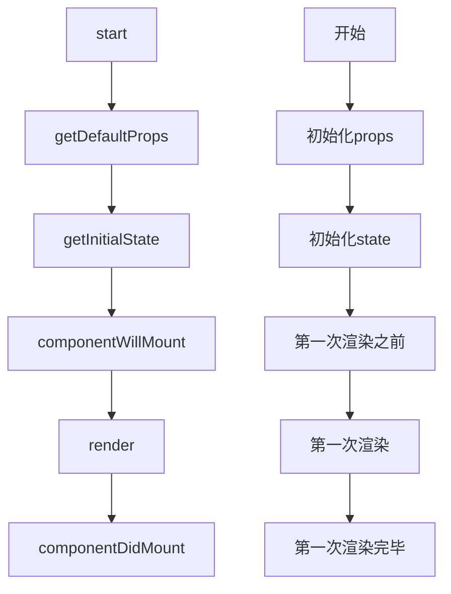

<!--
 * @Desc: md
 * @Author: zcc
 * @LastEditors: zcc
 * @Date: 2023-02-14 10:06:25
 * @LastEditTime: 2023-03-27 10:28:54
-->

# Getting Started with Create React App

## 配置修改

- 修改端口号/域名
- 修改环境变量

  - cross-env：

    - npm i cross-env
    - 通过 cross-env 修改端口

      ```json
        //package.json
        "scripts": {
          "start": "cross-env PORT=8080 node scripts/start.js",
          "build": "node scripts/build.js",
          "test": "node scripts/test.js"
        },
      ```

- 修改浏览器兼容，实现浏览器兼容

  ```json
    //package.json
    "browserslist": {
      "production": [
        ">0.2%",
        "not dead",
        "not op_mini all"
      ],
      "development": [
        "last 1 chrome version",
        "last 1 firefox version",
        "last 1 safari version"
      ]
    },
  ```

  - 对 postcss-loader 生效：控制 css3 的前缀
  - 对 bable-loader 生效：控制 es6 的妆换
  - 无法处理 es6 内置 api 的兼容：使用@babel/polyfill 对常见内置 API 进行重写

- 处理跨域

  - 在 src 目录下新建 setupProxy.js 文件
  - 安装依赖：npm i http-proxy-middleware
    - http-proxy-middleware：实现跨域代理模块，[webpack-dev-server 的跨域代理原理，也是基于它完成]

  ```javascript
  const { createProxyMiddleware } = require("http-proxy-middleware");
  module.exports = function (app) {
    app.use(
      createProxyMiddleware("/api", {
        target: "", //代理地址
        changeOrigin: true,
        ws: true,
        pathRewrite: { "^/api": "" },
      })
    );
  };
  ```

## js 基础

### 数组 tips

- 稀疏数组：创建长度为 N 的数组，其每一项都是 empty

  - new Array(5)
  - 稀疏数组不可循环
  - 基于数组的 fill 方法进行数据填充，把稀疏数组变为密集数组

    ```javascript
    const arr1 = new Array(5); // 稀疏数组
    let arr2 = arr1.fill(null); // 密集数组
    ```

- 密集数组：每一项都不是 empty
- for/in 缺点：性能消耗大
  - 既可以迭代共有属性，也可以迭代私有属性
  - 只能迭代“可枚举，非 symbol 类型”的属性
- 枚举：可以被列举，例如被 for/in,Object.keys 等列举出来
  - 一般来说，内置属性都是不可被枚举的
  - 自定义属性都是可以被枚举的
  - 修改成员的枚举属性：Object.defineProperty()
- 获取所有私有属性：包括私有属性，不可枚举属性，且不论类型
  - Object.getOwnPropertyNames(arr).concat(Object.getOwnPropertySymbols(arr))
    - Object.getOwnPropertyNames()：获取对象非 symbol 类型的私有属性（无关是否可枚举）
    - Object.getOwnPropertySymbols()：获取对象 symbol 类型的私有属性
  - Reflect.ownKeys(arr)
    - 缺点：ES6 方法，不兼容 IE

### 对象 tips

- 冻结 Object.freeze(obj)
  - 不能修改，不能新增，不能删除, 不能劫持（Object.defineProperty()）
  - 判断是否冻结 Object.isFrozen(obj) => flase/true
- 密封 Object.seal(obj)
  - 能修改，不能新增，不能删除, 不能劫持（Object.defineProperty()）
  - 判断是否密封 Object.isSeal(obj) => flase/true
- 不可扩展 Object.preventExtensions()

  - 除了不能新增，其他操作都可以
  - 判断是否可扩展 Object.isExtensible(obj) => flase/true

  > 被冻结的对象，既是不可扩展的，也是密封的；同理，被密封的对象，也是不可扩展的。

## react 基础

- 不直接操作 DOM，而是数据操作
  - 操作 DOM：想操作 A，要先获取 A
    - 缺点：消耗性能 主要原因：可能导致 DOM 回流/重绘
    - 操作前要先获取 DOM，相对麻烦
  - 数据驱动
    - 修改数据后，框架会按照相关数据，让页面重新渲染。
    - 不直接操作 DOM：而是操作虚拟 DOM
      - 从而实现了「虚拟 DOM->真实 DOM」的渲染体系
      - 有效避免 DOM 的回流/重绘，性能相对较好
- 视图
  - react：MVC 模式---数据驱动视图渲染
    - 构建视图层
    - 构建数据层：凡事要在视图中动态获取的，都需要有对应的数据模型
    - 控制层：修改相关数据，react 重新渲染视图
    - 单向驱动
  - vue：MVVM 模式---数据驱动视图渲染，而且可以监听视图修改数据（如表单数据）
    - modle,view,viewmodle
    - 双向驱动

## JSX 基础知识

1. JS 表达式
   - 变量/值
   - 数字运算
   - 判断：三元表达式
   - 循环：数组方法（map）
2. ReactDOM.createRoot 的时候不能把 HTML/BODY 作为根容器
3. 只能有一个根节点
4. react 提供特殊标签[<></>]空文档标记标签:React.Fragment
   - 既保证的既有一个根节点，又不新增一个 HTML 层级结构
5. {} 胡子语法中嵌入不同的值，所量现出来的特点
   - number/string：值是啥，就渲染出来啥
   - boolean/null/undefined/Symbol/BigInt：渲染的内容是空
   - 除数组对象外，其余对象一般都不支持在{}中进行渲染，但是也有特殊情况：
     - JSx 虚拟 DOM 对象
     - 给元素设置 style 行内样式，要求必须写成一个对象格式
   - 数组对象：把数组的每一项都分别拿出来渲染「井不是变为宇符串渲染，中间没有逗号」
   - 函数对象：不支持在{}中渲染，但是可以作为函数组件，用 <Component/＞ 方式渲染！！
6. JSX 底层处理机制

   - 第一步：把我们编写的 JSX 语法，编译为虛拟 DOM 对象 「virtualDoMj

     - 虚拟 DOM 对象：框架自己内部构建的一套对象体系（对象的相关成员都是 React 内部规定的），基于这些属性描述出，我们所构建视圈中的，DOM 节点的相关特征！！
     - 1. 基于 babel-preset-react-app 把 JSX 编译为 React.createElement（）这种格式
       - 只要是元素节点，必然会基于 createElement 进行处理！
       - React.createElement (ele, props, . . .children)
         - ele：元素标签名「或组件」
         - props：元素的属性集合(对象）「如果没有设置过任何的属性，则此值是 null
         - children：第三个及以后的参数，都是当前元素的子节点
     - 2. 再把 createElement 方法执行，创建出 virtualDOM 虚拟 DOM 对象「也有称之为：JSX 元素、JSX 对象、ReactChild 对象。。」！

       ```javascript
         virtualDOM = {
           $$typeof: Symbol(react.element) ,
           ref: null,
           kev: null
           type： 标签名「或组件」
           // 存储了元素的相关属性 8& 子节点信息
           props: {
             元素的相关属性
             children:子节点信息「没有子节点则没有这个属性、属性值可能是一个值、也可能是一个数组
           }
         }
       ```

   - 第二步：把构建的 virtua1DOM 渲染为真实 DOM

     - 真实 DOM：浏览器页面中，最后渲染出来，让用户看见的 DOM 元素！！
     - 基于 ReactDOM 中的 render 方法

       ```javascript
       // react v16
       ReactDOM.render(<>...</>, document.getElementById("root"));
       ```

       ```javascript
       // react v18
       const root = ReactDOM.createRoot(document.getElementById("root"));
       // 基于render方法渲染视图
       root.render(<>...</>);
       ```

   - 补充说明：第一次渲染页面是直接从 virtualDOM->真实 DOM；但是后期视图更新的时候，需要经过一个 DOM-DIFF 的对比，计算出补丁包 PATCH(两次视图差昇的部分），把 PATCH 补丁包进行渲染！！

7. 为元素设置属性[自定义/内置]，有两种方式

   - 元素.属性 = 属性值

     - 原理：对于内置属性，是设置在元素标签上；对于自定义属性来讲，是给对象的堆内存空间中新增成员（不会设置到标签上）
     - 获取：元素.属性
     - 删除：delete 元素.属性

   - 元素.setAttribute(属性，属性值)
     - 原理直接写在元素标签上
     - 获取：getAttribute
     - 删除：removeAttribute
       **二者不能混淆使用**

## 组件

### 函数组件

1. 渲染机制

- 基于 babel-preset-react-app 把调用的组件转化为 createElement 格式

  ```javascript
  React.createElement(Dome, {
    title: "xxx",
    x: 10,
    className: "box",
  });
  ```

- 把 createElement 方法执行，创建出一个 virtualDOM 对象

  ```javascript
    {
      $$typeof: Symbol(`react.element`),
      ref: null,
      kev: null,
      type: Dome,
      props: {
        title:'xxx',
        x:10,
        className:'box'
      },
    }
  ```

- 基于 root.render 把虚拟 dom 转变为真实 dom(type 值不再是一个字符串，而是一个函数了，此时)
  - 把函数执行-> Demo()
  - 把 virtualDOM 中的 props,作为实参传递给函数 -> Demo(props)
  - 接收函数执行的返回结果(也就是当前组件的 virtualDOM 对象)
  - 最后基于 render 把组件返回的虚拟 DOM 变为真实 DOM，插入到#root 容器中

2. 单闭合组件和双闭合组件的调用区别

   - 双闭合组件可以在 props 的 children 属性中传递子节点
   - 属性 props 的处理
     - 调用组件，传递进来的属性是"只读"的[原理:props 对象被冻结了]
     - Object.isFrozen(props) => true
     - 获取：props.xxx
     - 修改：props.xxx = aaa =>报错
     - 作用：父组件（index.jsx）调用子组件（demo.jsx）的时候，可以基于属性，把不同的信息传递给子组件,使其复用性更强
   - 属性的规则校验

     - 设置默认值
     - 把函数当作对象，设置静态的私有属性方法，来给其设置属性的校验规则

       ```javascript
       const Demo = function Demo(props) {
         let { title } = props;
         return <div>{title}</div>;
       };
       Demo.defaultProps = {
         title: "hello",
       };
       ```

     - 设置其他规则：依赖于官方插件[prop-types]

       - 传递进来的属性，首先会进行规则校验，不论校验成功失败，最后会把属性传递给 props，失败时会在控制台抛出错误

         ```javascript
         Demo.propTypes = {
           title: PropTypes.string.isRequired,
           title: PropTypes.oneOfType([
             // 多个类型中的一个
             PropTypes.bool,
             PropTypes.number,
           ]),
         };
         ```

   - 修改 Props 中的值
     - 把 props 中的某个属性赋值给其他内容，比如：变量，状态。。。
     - 然后修改变量值，状态值

3. 函数组件时静态组件:第一次渲染组件时
   - 执行函数
   - 产生一个私有上下文
   - 把解析出来的 props[包含 children]传递进来，但是被冻结了
   - 对函数返回的 jsx 元苏[virtualDOM]进行渲染
   - 当我们点击按钮时，会执行绑定函数
     - 修改上级上下文中的变量
     - 私有变量的值发生改变
     - 但是视图不会更新
   - 也就是说函数组件第一次渲染后，组建的内容，不会根据组件内的某些操作，再次进行更新，所以称之为静态组件

### 类组件

- 类 tips

  ```jsx
  class Parent{
    // new 的时候，执行构造函数[可写可不写，需要接受传递进来的实参信息，才需要设置constructor]
    constructor(x,y){
      // this -> 创建的实例
      this.total = x+y
    }
    // 等价于 this.num = 200 给实例设置私有属性
    num = 200
    getNum = ()=>{
      // 箭头函数没有自己的this,所用到的this是宿主环境中的
      // 当前this->当前创建的实例
      console.log(this)
    }
    sum()
      // 类似于sum=function sum(){} 不是箭头函数
      // 它是给Parent.prototype上设置的公共方法[sum函数是不可枚举]
    }
    // 把构造函数当作普通对象，为其设置静态的私有属性发发 Parent.xxx
    static avg = 100
  }

  // 在外部手动给构造函数原生上设置公共属性
  Parent.prototype.y =2000

  let p = new Parent(10,20)
  ```

- 创建类组件
  - 创建一个构造函数（类）
    - 要求必须继承 React.Component/PureComponent 这个类
    - 我们习惯于使用 es5 中的 class 创建类【因为方便】
    - 必须给当前类设置一个 render 方法[放在其原型上]：在 render 方法中，返回需要渲染的视图

#### 第一次渲染逻辑

> 从调用类组件[new Vote({...})]开始，类组件内部发生的事情

1. 初始化属性&&校验规则

   - 方案一

   ```javascript
   constructor(props){
     super(props) // 会把传递进来的属性挂载到this实例上
     console.log(this.props) // 获取传递的属性
   }
   ```

   - 方案二：即使我们不在 constructor 中处理[或者不写 constructor]，在 constructor 处理完毕后，React 内部也会把传递的 props 挂载到实例上：所以在其他函数中，只要保证 this 是实例，就可以基于 this.props 获取到传递的属性
     - 同样 this.props 获取属性对象也是被冻结的{只读}：Object.isFrozen(this.props)->true

2. 初始化状态
   - 状态：后期修改状态，可以触发视图更新
   - 需要手动初始化，如果我们没有去做相关处理，则默认会往实例上挂载一个 state，初始值是 null => this.state = null
   - 修改状态，控制试图更新
     - this.state.xxx = xxx 这种方法无法让视图更新
     - 需要根据 React.Component.proptotype 提供的方法操作：
       1. this.setState(partialState) 既可以修改状态，也可以让视图更新
          - partialState 部分是状态 this.setState({xxx:xxx})
       2. this.forceUpdate() 强制更新（不推荐）
3. 触发 componentWillMount 周期函数（钩子函数）：组件第一次渲染之前
   - 钩子函数：在程序运行到某个阶段，提供的处理函数，让开发者在这个阶段做一些自定义的事情
     - componentWillMount 这个周期函数：目前可以使用，但是未来要被移除了，所以不建议使用[浏览器控制台会进行 warning 警告]-可以使用 UNSAFE_componentWillMount 消除警告
     - 如果开启了 React.StrictMode[React 严格模式]：即使使用 UNSAFE_componentWillMount 也会抛出红色错误警告
       - React.StrictMode[React 严格模式]：会检查 React 中的不规范语法，或者是一些不建议使用的 api 等
       - "use strict":JS 严格模式
4. 触发 render 周期函数：渲染
5. 触发 componentDidMount 周期函数：第一次渲染完毕
   - 可以获取真实 DOM ：已经把 virtualDOM 转变为真实 DOM 了

##### 第一次渲染 流程图


#### 组件更新
##### 组件更新逻辑[组件内部更改]

1. 触发 shouldComponentUpdate 是否允许更新

   ```jsx
   shouldComponentUpdate(nextProps,nextState){
      // nextState:存储需要修改的最新状态
      // this.state:存储的还是修改之前的状态[此时状态还没有改变]
      console.log(this.state,nextState)
      // 此周期函数需要返回true/false
        // true：允许更新，会执行下一操作
        // false：不允许更新，接下来啥都不处理
      return true
    }
   ```

2. 触发 componentWillUpdate 更新之前
   - 此周期函数不安全
   - 这个阶段，状态还没有修改
3. 修改状态值/属性值 [让 this.state.xxx 更改为最新的值]
4. 触发 render 周期函数：组件更新
   - 按照最新的状态/属性，把返回的 JSX 编译为 virtualDOM
   - 和上次渲染出来的 virtualDOM 做对比[DOM-DIFF]
   - 把差异的部分进行渲染[渲染为真实 DOM]
5. 触发 componentDidUpdate 周期函数：第一次渲染完毕
6. 特殊说明：如果是基于 this.forceUpdate()强制更新视图，会跳过 shouldComponentUpdate 周期函数的校验，直接从 componentWillUpdate 开始更新[也就是：视图一定会触发更新]

##### 组件更新逻辑[父组件更新触发子组件更新]

1. 触发 componentWillReceiveProps 周期函数：接收最新属性之前
   - 此周期函数是不安全的
2. 触发shouldComponentUpdate周期函数
... 其他同组件更新逻辑[组件内部更改]

##### 父子组件更新流程

- 深度优先原则：父组件在操作过程中，遇到子组件，一定是把子组件处理完，父组件才能继续处理

  ```mermaid
      graph

      父组件第一次渲染 --> 父willMount
      父willMount --> 父render
      父render --> 子willMount
      子willMount --> 子render
      子render --> 子didMount
      子didMount --> 父didMount

      父组件更新 --> 父shouldUpdate
      父shouldUpdate --> 父willUpdate
      父willUpdate --> 父render
      父render --> 子shouldUpdate
      子shouldUpdate --> 子willUpdate
      子willUpdate --> 子render
      子render --> 子didUpdate
      子didUpdate --> 父didUpdate

  ```
#### 组件销毁
1. 触发componentWillUnmount周期函数：组件销毁之前
2. 销毁

### 静态组件与动态组件
> - 函数组件是“静态组件"：
>   - 组件第一次渲染完毕后，无法基于“内部的某些操作”让组件更新「无法实现“自更新”」；但是，如果调用它的父组件更新了，那么相关的子组件也-定会更新「可能传递最新的属性值进来」；
>   - 函数组件只具备属性，所以无法实现自更新
>   - 函数组件优势：比类组件的机制简单，渲染速度快
> - 类组件是“动态组件”：
>   - 组件在第一渲染完毕后，除了父组件更新可以触发其更新外，我们还可以通过：this.setstate修改状态 或者 this.forceupdate 等方式.让组件实现“自重新"！
>   - 类组件具备：属性、状态、周期函数、ref... 「几平组件应该有的东西它都具备」
>   - 优势：功能强大
> - hooks组件：具备了函数组件和类组件的各自优势，在函数组件的基础上，基于hooks函数，让函数组件也可以拥有状态，周期函数等，让函数组件也可以实现自更新

### PureComponent和Component的区别：
- PureComponent会给类组件默认加一个shouldComponentupdate周期函数
  - 在此周期函数中，它对新老的属性/状态 会做一个钱浅比较
  - 如果经过浅比较，发现属性和状态井没有改变，则返回false 「也就是不继续更新组建」；有变化才会去更新！！

```js
// 检查是否为对象
const isObject = (obj) => {
  return obj !== null && /^(object|function)$/.test(typeof obj);
};
// 对象的 浅比较（只比较一层）
const shalldowEqual = (objA, objB) => {
  // 如果不是对象的话，直接返回false
  if (!isObject(objA) || !isObject(objB)) return false;
  // 判断是否是同一个对象，是的话直接返回true
  if (objA === objB) return true;
  // 比较成员数量
  /**
   * Object.keys()返回属性key，但不包括不可枚举的属性
   * Reflect.ownKeys()返回所有属性key 相当于Object.getOwnPropertyNames(target) concat(Object.getOwnPropertySymbols(target)
   * * getOwnPropertyNames(): 返回所有属性的数组
   * * Object.getOwnPropertySymbols(): 返回所有符号属性直接发现在给定的对象
   */
  let keysA = Reflect.ownKeys(objA),
    keysB = Reflect.ownKeys(objB);
  // 如果成员数量不相等，肯定不相等，直接false
  if (keysA.length !== keysB.length) return false;
  for (let i = 0; i < keysA.length; i++) {
    const key = keysA[i];
    // 比较对象中的成员是否相同，再比较成员的值是否一样
    // NAN 不等于 NAN 但是Object.is(NAN）===Object.is(NAN）
    if (!objB.hasOwnProperty(key) || !Object.is(objA[key], objB[key])) {
      return false;
    }
  }
  // 以上没有不同的成员，就直接相等
  return true;
};
```

### hooks 组件

## 插槽

1. 封装组件时，预留插槽位置

```jsx
const Demo = function Demo(props) {
  let { children } = props;
  return <div>{children}</div>;
};
```

2. 多个插槽

```jsx
import React from "react";
const Demo = function Demo(props) {
  let { children } = props;
  children = React.Children.toArray(children);
  // 由于props中的children返回数据格式的不确定性，可以利用React.Children中提供的方法对props.children数据做处理
  return (
    <div>
      {children[0]}
      <a>1</a>
      {children[1]}
    </div>
  );
};
```

3. 具名插槽

```jsx
import React from "react";
const DemoFather = function Demo(props) {
  return (
    <Demo>
      <span slot="fisrt">1</span>
      <span slot="second">2</span>
      <span>3</span>
    </Demo>
  );
};

const Demo = function Demo(props) {
  let { children } = props;
  children = React.Children.toArray(children);
  let fisrt, second, defaultSlot;
  children.forEach((a) => {
    const { slot } = a.props;
    if (slot === "fisrt") {
      fisrt.push(a);
    } else if (slot === "second") {
      second.push(a);
    } else {
      defaultSlot.push(a);
    }
  });
  return (
    <div>
      {fisrt}
      <p>1</p>
      {second}
    </div>
  );
};
```

## render 函数

- 如果 type 是
  - 字符串：创建一个标签
  - 普通函数：把函数执行，并把 Props 传递给函数
  - 构造函数：把构造函数基于 new 执行[也就是创建类的一个实例]，也会把解析出来的 props 传递过去
    - 每调用一次类组件都会创建一个单独的实例
    - 把类组件中编写的 render 函数执行，把返回的 jsx[virtualDOM]当作组件视图进行渲染！！
## DOM相关

- componentDidMount :第一次渲染完毕[virtualDOM已经变为真实DOM]：此时我们可以获取所需操作的DOM元素
### 受控组件与非受控组件
- 受控组件：基于修改数据/状态，让视图更新，达到需要效果
- 非受控组件：基于ref获取DOM元素，我们操作DOM元素，来实现需求和效果

### 基于ref获取DOM元素的语法
1. 给需要获取的元素设置ref=’xxx’，后期基于this.refs.xxx去获取相应的DOM元素「不推荐使用」
  - <h2 ref="titleBox">...</h2> 
  - 获取：this.refs.titleBox
2. 把ref属性值设置为一个函数
  - ref={x=>this.xxx=x}
    - x是函数的形参：存储的就是当前DOM元素
    - 然后我们获取的DOM元素“x"直接挂在到实例的某个属性上（例如：box2）
    - 获取：this.xxx
> 原理：在render渲染的时候，会获取virtualDOM的ref属性
>  - 如果属性值是一个字符串，则会给this.refs增加这样的一个成员，成员值就是当前的DOM元素
>  - 如果属性值是一个西数，则会把西数执行，把当前DOM元素传递给这个西数「x->DOM元素」，而在西数执行的内部，我们一般都会把DOM元素直接挂在到实例的某个属性上